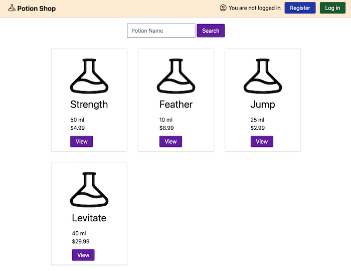

# Potion Shop

Potion Shop is an intentionally vulnerable Elixir/Phoenix application, for teaching developers about web application security. This project is vulnerable to common vulnerabilities such as XSS, CSRF, and RCE. 

**Warning** - Do not deploy this application in your production environment. Attackers can exploit Potion Shop to gain access to the underlying server, then use this access to further compromise your network. 

## This code is cloned from Pluralsight public github repo focusd on security vulnerabilities.

## Setup

If Brew is missing install Brew
First, you need to install some dependencies. Open your terminal and run:
Run - sudo apt-get install build-essential curl file git

Once the dependencies are installed, you can install Linuxbrew using the following command:
/bin/bash -c "$(curl -fsSL https://raw.githubusercontent.com/Homebrew/install/HEAD/install.sh)"

After the installation is complete, you need to add Linuxbrew to your environment variables. You can do this by adding the following lines to your .bashrc or .zshrc file:
echo 'eval "$(/home/linuxbrew/.linuxbrew/bin/brew shellenv)"' >> ~/.bashrc
source ~/.bashrc

Or install Elixir using homebrew - brew install elixir

Important points
Credo task must be added to mix deps do array. 

Credit app authors

Michael Lubas - https://www.linkedin.com/in/michaellubas/

Jonathan Kilby - https://www.linkedin.com/in/jonathankilby1991/

